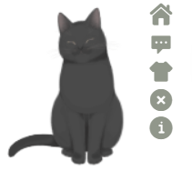
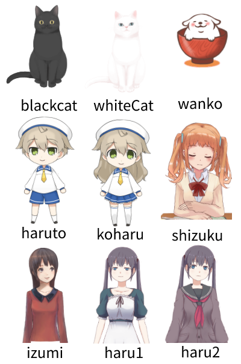

# @vuepress-reco/vuepress-plugin-kan-ban-niang

## Details

> kan-ban-niang plugin for vuepress-theme-reco or other vuepress theme.  
> Vuepress 看板娘插件

|使用位置|值|
|-|-|
|plugin name|@vuepress-reco/vuepress-plugin-kan-ban-niang|
|component name|KanBanNiang（自动出现在页面中，无需添加额外代码）|

## Buttons

|按钮|作用|提示语|
|-|-|-|
|home|回到博客主页|心里的花，我想要带你回家。|
|message|显示主人寄语|'欢迎来到 ' + 您的站点名称（$site.title）|
|theme|更换模型主题|好吧，希望你能喜欢我的其他小伙伴。|
|close|关闭看板娘|你知道我喜欢吃什么吗？痴痴地望着你。|
|info|跳转插件github|想知道关于我的更多信息吗？|

## Options

> 以下为插件注入时的参数。

**Attributes**

|参数|说明|类型|默认值|可选值|
|-|-|-|-|-|
|theme|默认模型主题|string|'blackCat'|见最后|
|message|主人寄语|string|'欢迎来到 ' + 您的站点名称（$site.title）|-|
|messageStyle|自定义消息框样式|Object|{ position: 'fixed', right: '80px', bottom: '195px'}|-|
|modelStyle|自定义模型样式|Object|{ position: 'fixed', right: '90px', bottom: '-20px', opacity: '0.9'}|-|
|width|模型宽度|number|150|-|
|height|模型高度|number|220|-|

## theme可选值

## About

参考插件: [@Qi](https://github.com/QiShaoXuan) https://github.com/QiShaoXuan/vuepress-plugin-cat  
模型库： [@Qi](https://github.com/QiShaoXuan) https://github.com/QiShaoXuan/live2DModel

